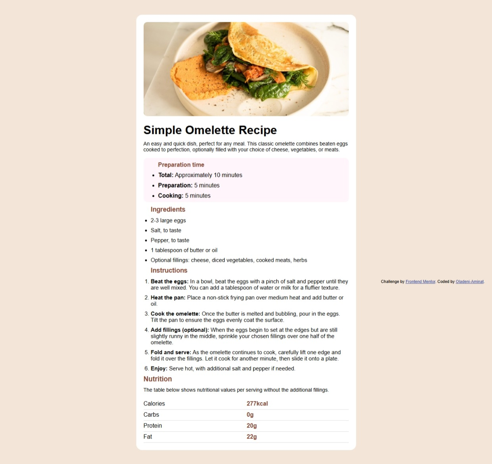

# Frontend Mentor - Recipe page solution

This is a solution to the [Recipe page challenge on Frontend Mentor](https://www.frontendmentor.io/challenges/recipe-page-KiTsR8QQKm). Frontend Mentor challenges help you improve your coding skills by building realistic projects. 

## Table of contents

- [Overview](#overview)
  - [The challenge](#the-challenge)
  - [Screenshot](#screenshot)
  - [Links](#links)
- [My process](#my-process)
  - [Built with](#built-with)
  - [What I learned](#what-i-learned)
  - [Continued development](#continued-development)
  - [Useful resources](#useful-resources)
  - [AI Collaboration](#ai-collaboration)
- [Author](#author)
- [Acknowledgments](#acknowledgments)


## Overview
This project is a page build using different HTML semantics.The goal was to recreate the provided design similar to what  was given.

### Screenshot



### The challenge
The challenge was to build a recipe page solution and make sure the layout,spacing,fonts,colors,image and other elements look similar to the original design.


### Links

- Solution URL: [Add solution URL here](https://your-solution-url.com)
- Live Site URL: [Add live site URL here](https://your-live-site-url.com)

## My process
I started by creating the HTML structure of the webpage and arrange them according to the design.
i worked on the layout,colors,spacing,image,borders and responsiveness. i also tested the webpage browser and corrected some styling issues along the way.


### Built with

- Semantic HTML5 markup
- CSS
- Flexbox
- [Styled Components](https://fonts.goggle.com/specimen/outfit) - For styles

### What I learned

I learned more on different html semantics and some css too,like:

```html
<section class="preparation-time> </section>
<table>
 <tr>
    <td>Calories</td>
    <th>277kcal</th>
  </tr>
</table>
```
```css
table {
  border-collapse:collapse;
}
```


### Continued development

After during this project,i realize there's more on html semantics that i don't know. so,i will like to have more knowledge on that.
and also, i want to start learning javascripts too not restricting to html and css only.

### Useful resources
MDN Web Docs; useful for learning HTML and CSS
Frontend Mentor; useful for practicing frontend development through coding challenges


### AI Collaboration

goggle chrome

## Author
Oladeni Aminat Olabisi
- github - [Oladeni-Aminat](https://github.com/Oladeni-Aminat)
- Frontend Mentor - [@Oladeni-Aminat](https://www.frontendmentor.io/profile/Oladeni-Aminat)


## Acknowledgments
Thanks to Frontend Mentor for providing the challenge and design that helped me practice my frontend developmemt skills. Also, thanks to the one who introduce frontend to me and learning resources that helped me understand and improve my code.
